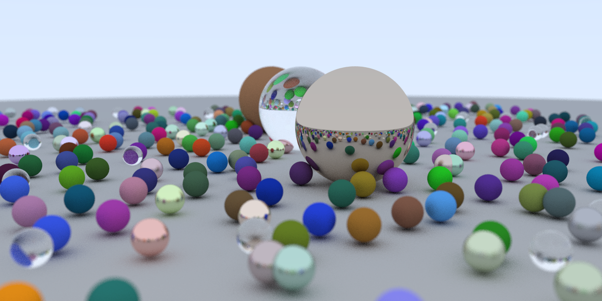
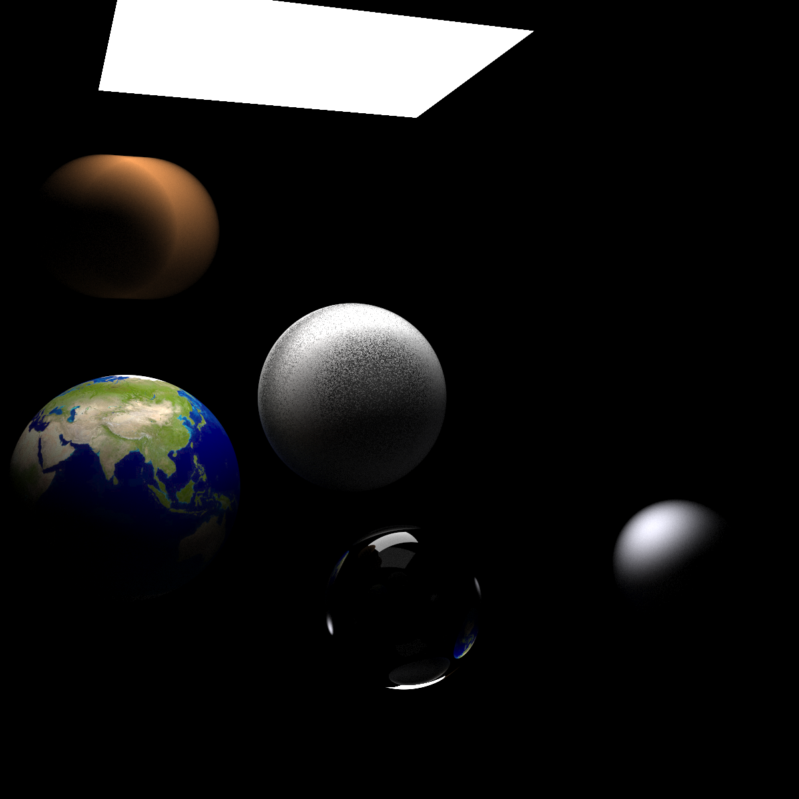
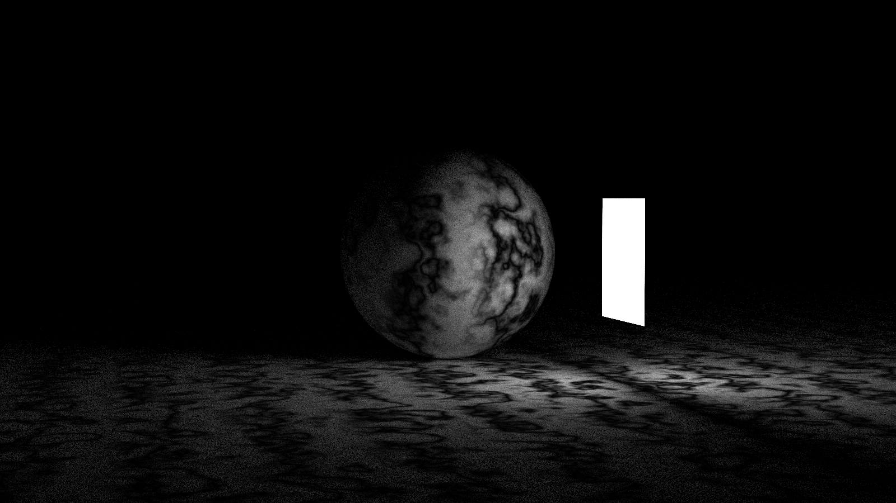
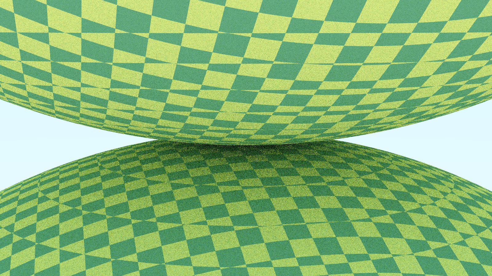
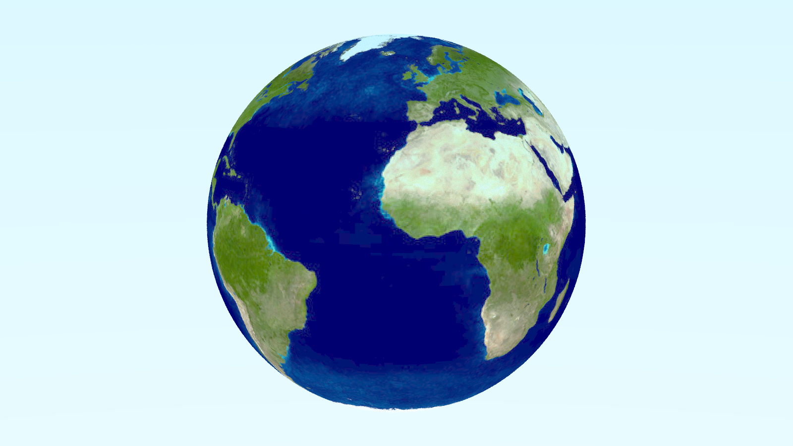
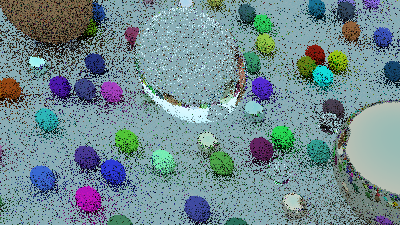
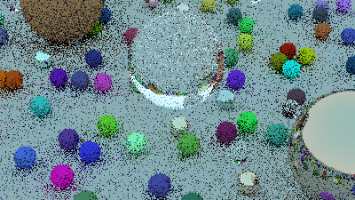
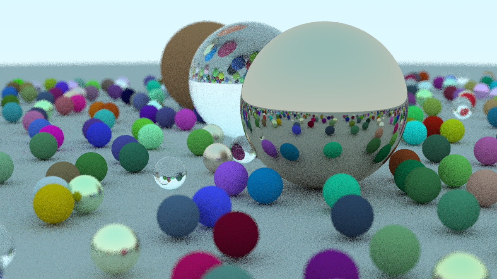
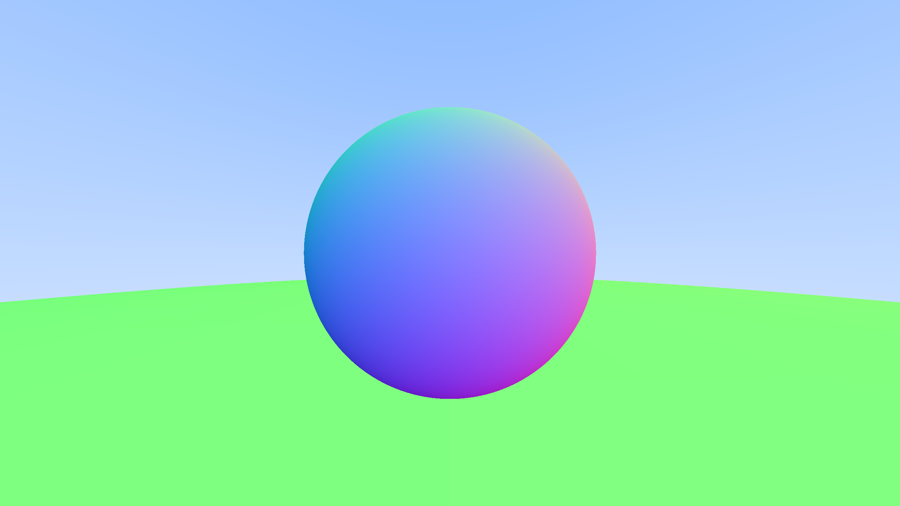

# RayTracing-Learning Devlog

##### 10/15/2020

- Material and final scene done

- Final scene render using CUDA

  ```powershell
  $ nvprof.exe --print-gpu-trace .\RayTracer-GPU.exe
  Rendering a 1200x600 image in 8x8 blocks.
  ==2144== NVPROF is profiling process 2144, command: .\RayTracer-GPU.exe
  took 0.003 seconds to init render random.
  took 2400.76 seconds to render the image.
  
  Done.
  ==2144== Profiling application: .\RayTracer-GPU.exe
  ==2144== Profiling result:
     Start  Duration            Grid Size      Block Size     Regs*    SSMem*    DSMem*           Device   Context    Stream        Unified Memory  Virtual Address  Name
  291.07ms  34.848us              (1 1 1)         (1 1 1)        92        0B        0B  GeForce GTX 107         1         7                     -                -  rand_init(curandStateXORWOW*) [107]
  292.44ms  61.221ms              (1 1 1)         (1 1 1)       119        0B        0B  GeForce GTX 107         1         7                     -                -  create_world(Hittable**, Hittable**, Camera**, int, int, curandStateXORWOW*) [120]
  353.79ms  2.9074ms           (151 76 1)         (8 8 1)        97        0B        0B  GeForce GTX 107         1         7                     -                -  render_init(int, int, curandStateXORWOW*) [127]
  357.41ms  2.4e+03s           (151 76 1)         (8 8 1)        48        0B        0B  GeForce GTX 107         1         7                     -                -  render(Vector3*, int, int, int, Camera**, Hittable**, curandStateXORWOW*) [138] 
  
  Regs: Number of registers used per CUDA thread. This number includes registers used internally by the CUDA driver and/or tools and can be more than what the compiler shows.
  SSMem: Static shared memory allocated per CUDA block.
  DSMem: Dynamic shared memory allocated per CUDA block.
  ```

  


##### 10/12/2020

- Hittable object : Sphere and HittableList

- Memory management should be careful

- Introduce **[cuRAND ](https://docs.nvidia.com/cuda/curand/index.html)library** for random numbers in CUDA

  Note that we initialize `rand_state` for every thread and `curand_init` is very time costing. So for performance measurement, we may want to separate the time for random initialization from rendering time -> make a separate kernel.

- Antialiasing

- Recursion -> Iteration

  In serial version code, we use recursion in `ray_clor` function, as we are now using CUDA, this behavior could easily cause an stack overflow since it can call itself many times. So we need translate recursion into iteration. 

  For an elaborate description regarding iteration vs. recursion, please read SICP.

- A reminder: for now we use `curand_uniform` for random number generate, and for future **Monte Carlo** method we may need to use something like `curand_normal`

  

##### 10/11/2020

- Basic ray hit and write color function done

  

- Reading [libcudacxx]() for a **smart pointer** substitute, if none exists, we'll have to use **raw point** to manage memory and stuff


##### 10/01/2020

- Set up CUDA for visual studio
  - CUDA v9.0
  - https://docs.nvidia.com/nsight-visual-studio-edition/3.2/Content/CUDA_Properties_Config.htm
  - Solve CUDA&Visual Studio version conflict: 
    - https://stackoverflow.com/questions/47780355/cuda-compiling-error-after-installing-it
    - https://dev.to/yumetodo/list-of-mscver-and-mscfullver-8nd
  
- Adjust Math headers for CUDA
  
  - CUDA is compatible with C++ and the Vector3 class will be used on both GPU & CPU, so we add **host device** as a qualifier to all methods.
  
- Ray class 

  - \_\_device\_\_ qualifiers considering that it's only used on GPU

- Reduce precision from **double** to **float**, unless you have a GPU with NVIDIA's full implementation of GA100 GPU specifications :0

  


##### 09/20/2020

- Use stbi_write to write png image instead of using c++ std::cout to create ppm image

- Use tbb for multi-thread rendering acceleration

- Final scene with acceleration

  


##### 09/17/2020

- "Ray Tracing The Next Week" Done
- Rectangle Light

- Noise Texture

  

- Volume with Constant Density Mediums

- Single thread raytracing is sinful, plan to use TBB to accelerate

- Final Scene - Take days to render, so image may be demonstrated next time


##### 09/14/2020

- "Ray Tracing The Next Week" Ongoing

- Motion Blur

  - Add time parameter to ray
  - Moving sphere as Hittable

- BVH

- Solid Color Texture, Checker Texture & Image Texture

  

  


##### 09/10/2020

- "Ray Tracing in One Weekend" Complete

- Cross-Product bug caused shear:

  - Wrong: `return Vector3(y * rhs.z - z * rhs.y, z * rhs.x - x * rhs.z, x * rhs.y - rhs.x);`

    

  - Right: `return Vector3(y * rhs.z - z * rhs.y, z * rhs.x - x * rhs.z, x * rhs.y - y * rhs.x);`

    

- Final Scene:

  


##### 09/07/2020

- random utility
	- C++ \<random\> header 
- `camera.h `
- Antialiasing
- Diffuse Material
- Gamma Correction 


##### 09/06/2020

- Basic code structure 

- Classes:

  - Math: Vector3, MathUtils
  - Ray
  - Hittable -> Sphere/HittableList

- Img:

  