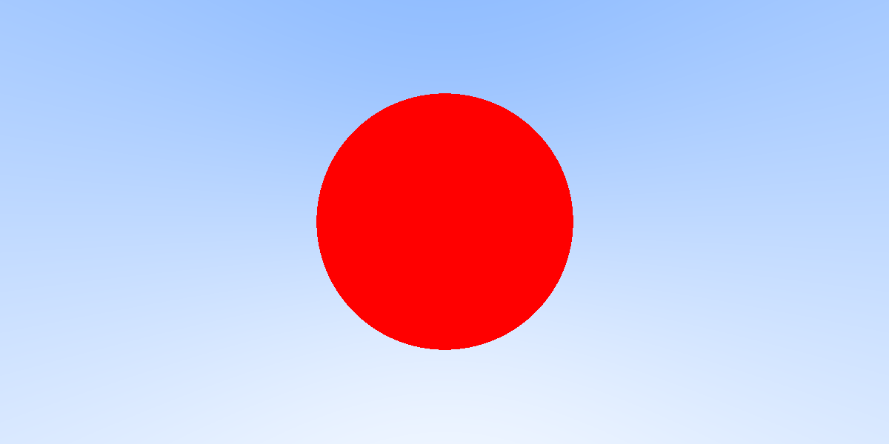

# RayTracing-Learning Devlog

##### 10/11/2020

- Basic ray hit and write color function done

  

- Reading [libcudacxx]() for a **smart pointer** substitute, if none exists, we'll have to use **raw point** to manage memory and stuff

##### 10/01/2020

- Set up CUDA for visual studio
  - CUDA v9.0
  - https://docs.nvidia.com/nsight-visual-studio-edition/3.2/Content/CUDA_Properties_Config.htm
  - Solve CUDA&Visual Studio version conflict: 
    - https://stackoverflow.com/questions/47780355/cuda-compiling-error-after-installing-it
    - https://dev.to/yumetodo/list-of-mscver-and-mscfullver-8nd
  
- Adjust Math headers for CUDA
  
  - CUDA is compatible with C++ and the Vector3 class will be used on both GPU & CPU, so we add **host device** as a qualifier to all methods.
  
- Ray class 

  - \_\_device\_\_ qualifiers considering that it's only used on GPU

- Reduce precision from **double** to **float**, unless you have NVIDIA's full implementation of GA100 GPU specifications :0

  

##### 09/20/2020

- Use stbi_write to write png image instead of using c++ std::cout to create ppm image

- Use tbb for multi-thread rendering acceleration

- Final scene with acceleration

  

##### 09/17/2020

- "Ray Tracing The Next Week" Done
- Rectangle Light

- Noise Texture

  

- Volume with Constant Density Mediums

- Single thread raytracing is sinful, plan to use TBB to accelerate

- Final Scene - Take days to render, so image may be demonstrated next time

##### 09/14/2020

- "Ray Tracing The Next Week" Ongoing

- Motion Blur

  - Add time parameter to ray
  - Moving sphere as Hittable

- BVH

- Solid Color Texture, Checker Texture & Image Texture

  

  

##### 09/10/2020

- "Ray Tracing in One Weekend" Complete

- Cross-Product bug caused shear:

  - Wrong: `return Vector3(y * rhs.z - z * rhs.y, z * rhs.x - x * rhs.z, x * rhs.y - rhs.x);`

    

  - Right: `return Vector3(y * rhs.z - z * rhs.y, z * rhs.x - x * rhs.z, x * rhs.y - y * rhs.x);`

    

- Final Scene:

  

##### 09/07/2020

- random utility
	- C++ \<random\> header 
- `camera.h `
- Antialiasing
- Diffuse Material
- Gamma Correction 

##### 09/06/2020

- Basic code structure 

- Classes:

  - Math: Vector3, MathUtils
  - Ray
  - Hittable -> Sphere/HittableList

- Img:

  